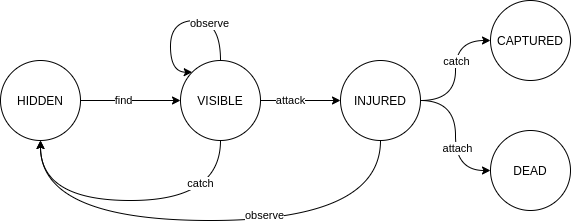
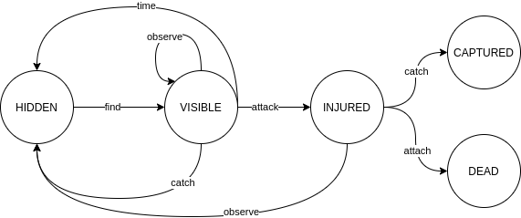
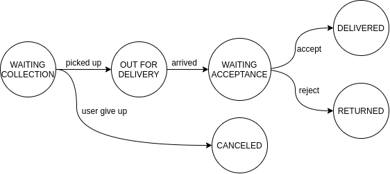

# Finite State Machine

    

Respositório referente a apresentação "Controlando transações de status com Finite State Machine" realizada no dia 05 de Dezembro de 2020 no evento "DevPira 2020" na trilha de BackEnd. 

A idéia é mostrar alternativas de design para diferentes problemas enfrentados diariamente.

## DevPira 2020

"O DevPira Festival é um evento de integração entre seres, ferramentas e metodologias. Acreditamos que a troca de conhecimentos e informação age de maneira efetiva sobre a qualidade profissional, por isso, idealizamos com muito carinho palestras, workshops e interações exclusivas a fim de podermos unir pontos e expandir a comunidade tecnológica no interior de São Paulo e no mundo.
Teremos palestrantes de São Paulo, Portugal, Espanha e Piracicaba, trazendo seus pontos de vista individuais e coletivos sobre os mais diversos assuntos. O DevPira Festival não é somente um evento de tecnologia, é um evento para pessoas que transformam o futuro." - https://devpira.com.br

## Projetos

### Pokemon Catcher - Python

    

Solução interativa em Python de uma máquina de estados implementada na mão, sem utilização de Frameworks de um game de captura de pokemons. 

[Repo: pokecatcher-python](./pokecatcher-python)

### Pokemon Catcher - Java

    

Solução interativa em Java utilizando o Framework Spring StateMachine para o controle de estados de um game de captura de pokemons. 

[Repo: ./pokecatcher-spring-statemachine](./pokecatcher-spring-statemachine)

### FSM Delivery - Java

    

Solução em Java utilizando o Framework Spring StateMachine de uma aplicação de controle de status de um delivery utilizando banco e mensageria para leitura dos eventos e acionamento da máquina de estados. 

[Repo: fsm-delivery-spring-statemachine](./fsm-delivery-spring-statemachine)

## Links

- [Apresentação em slides - DevPira 2020](https://docs.google.com/presentation/d/1sFcJffwwWrUx4zeb1DB9MdSoWUu8AJZb6cb2ayJ53k8/edit?usp=sharing)
- [Artigo - Controlando transações de status com finite state machine](https://medium.com/@guilherme.zarelli/controlando-transações-de-status-com-finite-state-machine-7f47b906174a)

# Desenvolvedor

**Guilherme Biff Zarelli**
- Blog/Site - https://helpdev.com.br
- LinkedIn - https://linkedin.com/in/gbzarelli/
- GitHub - https://github.com/gbzarelli
- Medium - https://medium.com/@guilherme.zarelli
- Email - gbzarelli@helpdev.com.br